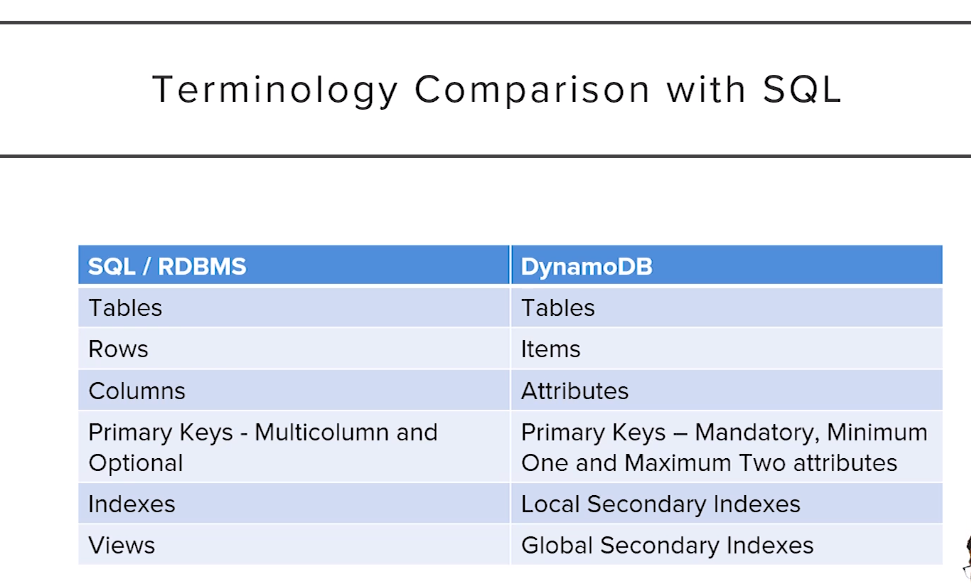
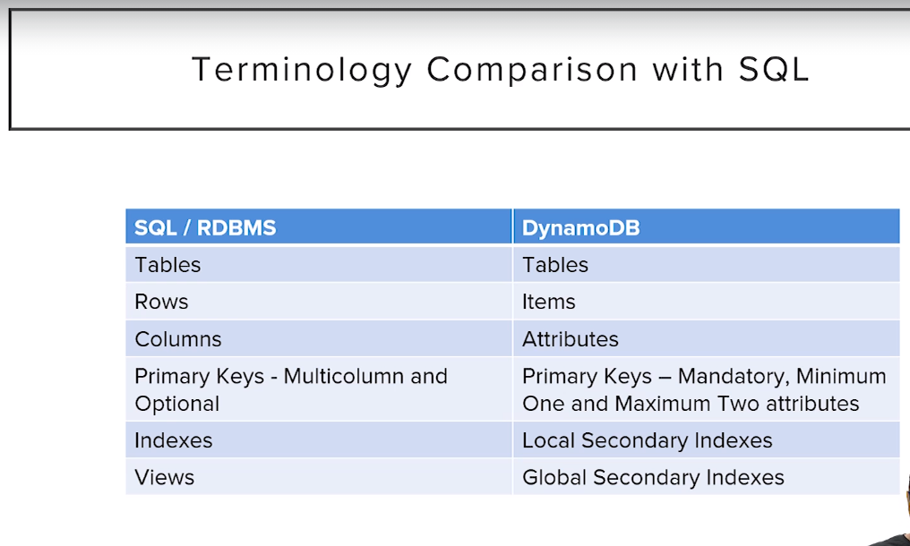
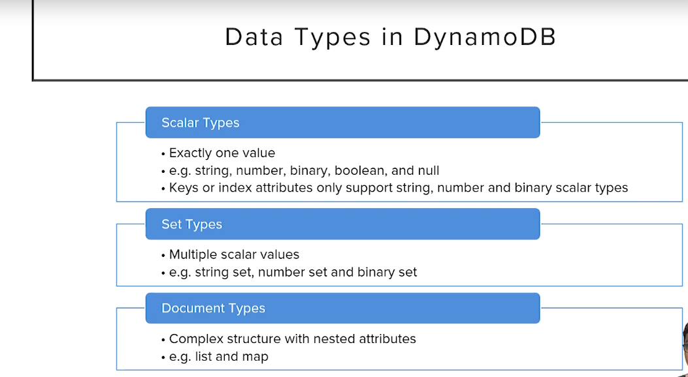
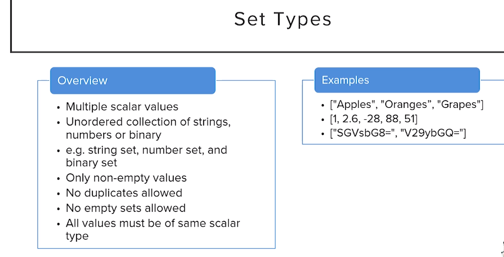
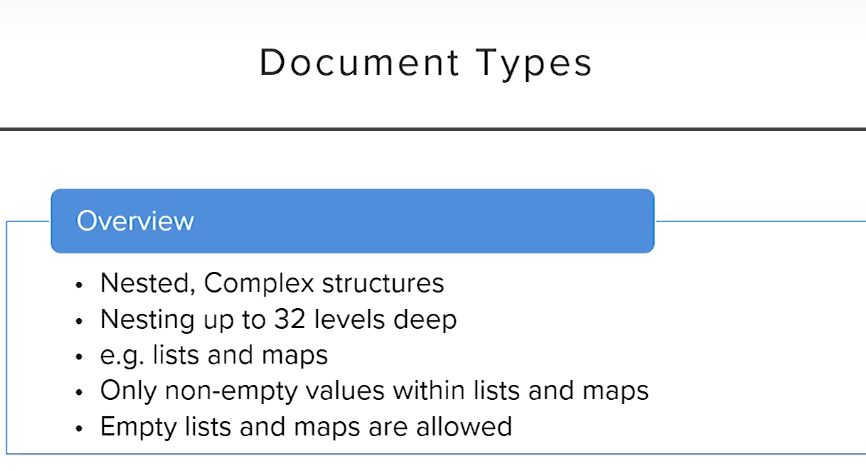
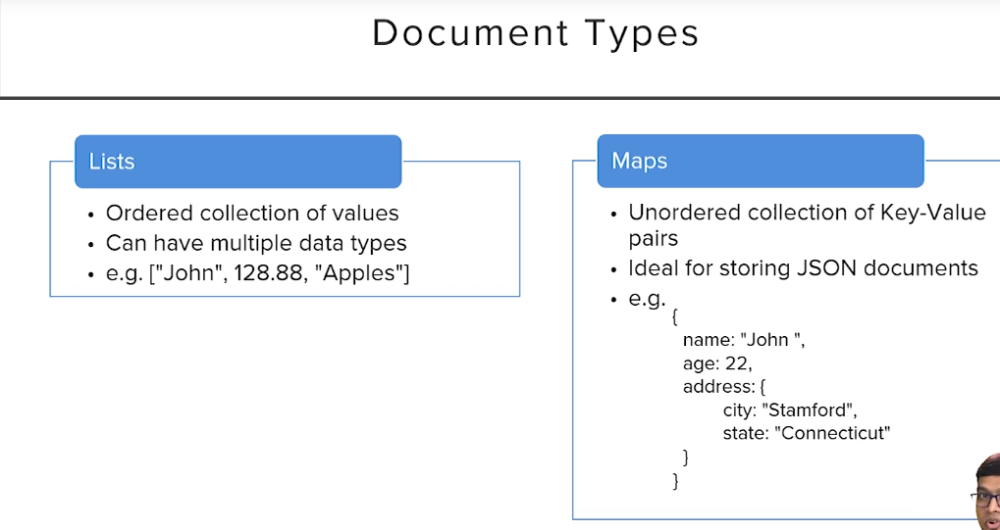
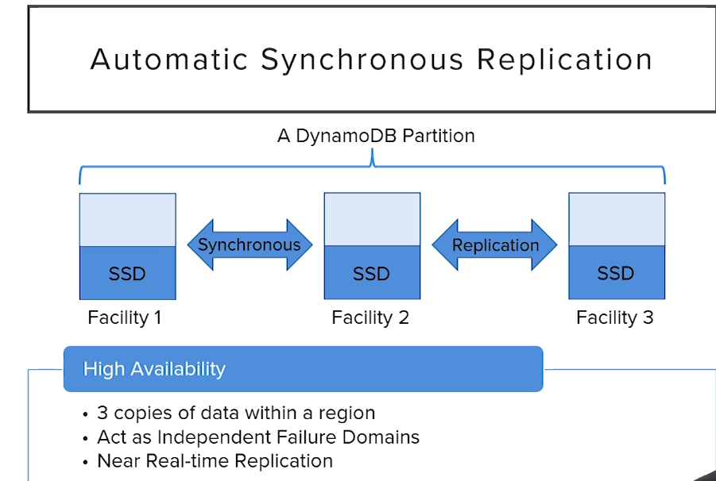

# About DynamoDB

## What is dynamoDB?
 .dynamodb is fully managed serverless nosql-DB(nosql allows you to work with big data) which can scale on demand 
 .dynamoDb useses json to interact with it but it actually stores data as a superset datatype supported by json
 .used best for unstructured databases(flexible than sql DBs)
 .we need to mention how many read and writes we need per second
 
 ---

#-todo 
.q: what are unstructured DB and how is it diff from structured
.q: expand on the datatypes and their examples for each different datatypes
.q: what is primary key and what are their combinatons
q:why is it named partition key
Q: within region ,avilability zone,
Q:Amazon DynamoDB Accelerator (DAX)
Q:when to use ordered list and unordered list

---

 dynamodb basics we will learn in this
 section:
 1.terminology comparision with sql 
 2.Data Types
 3.consistency Model
 4.capacity units
 5.DynamoDB partitions
 6.DynamoDb indexes

### 1.terminology
 3.1.
 3.2. each item in the DyDB can be considered json document collection store and items as an json obj
 3.3. in dynamodb we are having 2 primary attributes i.partition_key and ii.sort_key
 3.3.1. in dyDB all tables should contain primary key unlike sqlDBs

 ### 2.DATA TYPES
 3.4.1. dynamoDB data types 
 3.4.2. only sclar types can be used in DyDB as primary key
 3.4.3. set type-un ordered collection of single type and no duplicates and no empty sets
 
 3.4.4.document-type are having list and maps
 
 

### 3.consistency
3.5.1.DyDb stores the data accross multiple avilability zones facilities

3.5.2.DyDB can give the data consistently at 1 second 
3.5.3.if we need even sooner data then we go to strongly consistent it is costly but you get data as soon as recived

