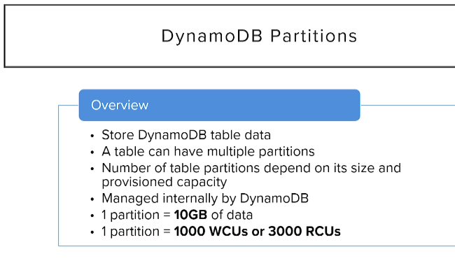

# About DynamoDB

## What is dynamoDB?
 .dynamodb is fully managed serverless nosql-DB(nosql allows you to work with big data) which can scale on demand  
 .dynamoDb useses json to interact with it but it actually stores data as a superset datatype supported by json 
 .used best for unstructured databases(flexible than sql DBs) 
 .we need to mention how many read and writes we need per second 
 
 ---

#-todo  
Q: what are unstructured DB and how is it diff from structured 
Q: expand on the datatypes and their examples for each different datatypes 
Q: what is primary key and what are their combinatons 
Q:why is it named partition key 
Q: within region ,avilability zone, 
Q:Amazon DynamoDB Accelerator (DAX) 
Q:when to use ordered list and unordered list 
Q:calcute the cost of dynamoDB
Q:what is the partition mean and their data sizes

---

 dynamodb basics we will learn in this 
 section: 
 1.terminology comparision with sql 
 2.Data Types 
 3.consistency Model 
 4.capacity units 
 5.DynamoDB partitions 
 6.DynamoDb indexes 

### 1.terminology
 4.1.  
 4.2. each item in the DyDB can be considered json document collection store and items as an json obj 
 4.3. in dynamodb we are having 2 primary attributes i.partition_key and ii.sort_key 
 4.3.1. in dyDB all tables should contain primary key unlike sqlDBs 

 ### 2.DATA TYPES
 4.4.1. dynamoDB data types  
 4.4.2. only sclar types can be used in DyDB as primary key 
 4.4.3. set type-un ordered collection of single type and no duplicates and no empty sets 
  
 4.4.4.document-type are having list and maps
  
  

### 3.consistency
4.5.1.DyDb stores the data accross multiple avilability zones facilities

 4.5.2.DyDB can give the data consistently at 1 second called eventual consistency it is default
 4.5.3.if we need even sooner data then we go to strongly consistent it is costly but you get data as soon as recived

### 4.Capacity Unit
 4.7.1 about RCU(Read capacity unit) 
 4.7.2.each RCU is worth 1 strong consistent or 2 eventual consistent and for reading of block ,each block is max 4kb.. so 1 rcu consumes 4kb for strong consistecy and 0.5 RCU for 4kb for eventual consistency
 4.7.3. WCU(write capacity unit) 1WCU=1 table write/s and is used in block of 1kb
 4.7.4. an exapmle for how the RCU and WCU are calculated irl:  
 4.7.8.if we are accessing more than our allocated scope RCU or WCU aws will use burst capacity to help us ease the throttle but if the burst capacity is being used for long time aws will let the function throttle so Burst capacity is only relied on sudden spikes 
  
 4.7.9. scaling capacity up and down

  
16/11/2021 free tier :{25 provisioned Write Capacity Units (WCU)
25 provisioned Read Capacity Units (RCU)
Enough to handle up to 200M requests per month.}

### 5.DynamoDB Partitions
4.8.1.partition are the storage space allocated by dyDB toa table and a single table can have multiple partitions
 4.8.2.each partition is of size 10gb and 1 partition= 1000wcu or 3000rcu and new partition are added in background 
 
 4.8.3.when a Partition is full then two new partitions are created and the existing partition is divided equally between them and old partition is deleted.  
  4.8.4.partitions are tricky because once we have increased the no of partitions we can not decrease the number of partitions thus paying for all partitions only thing to do is to increase the throughput(overall capability to process data) and use the partitions or to delete the table and recreate it with limited partitions

 4.8.5  

### 6. DynamoDB Index
 4.9.1. In dynamoDB there are two different index keys i)primary index(primary partition key && primary_sort_key? ) and ii)secondary index(local secondary index and global secondary index)
 4.9.2. all index keys have two sub divisions as 1.simple key = only partition key and 2.composite key= partition key and sort key 
 4.9.3. partition key is also called as hash key without it we can not querey the table but we can still scan the table but it is not good practise to scan the table because it is going to select every item in the table and check thus increasing the RCU astronomically

table: user_id use_name 

 local secondary index is a index which has same partition key as the primary index so only sort key changes,
 we can only have 5 local secondary index,
  we can create local secondary index only during the creation of the table.local secondary index works with both strong consistent and eventually consistent data

global secondary index unlike LSI we can have diff partition key but just like LSI we can have only 5 GSI but unlike LSI we can define it any time we want aster the creation of the table. GSI are placed in a seperate partition so they can also have different throughput , and unlike LSI it can only work with eventual consistent data and since it is having diff partition key from the table there can be duplicates in the GSI partition keys

 creation of the local index in the dynamo DB table:

   the projected attributes decide along with the primary and sort attributes which attributes to be selected(with include we can select 20 attributes)
  we have to make sure that we are aware of all the requirements the table is going to have now and also in the future and plan accordingly
 if we dont provide local secondary or global secondary index then when we search the table based on them then the items without them will not showup 

